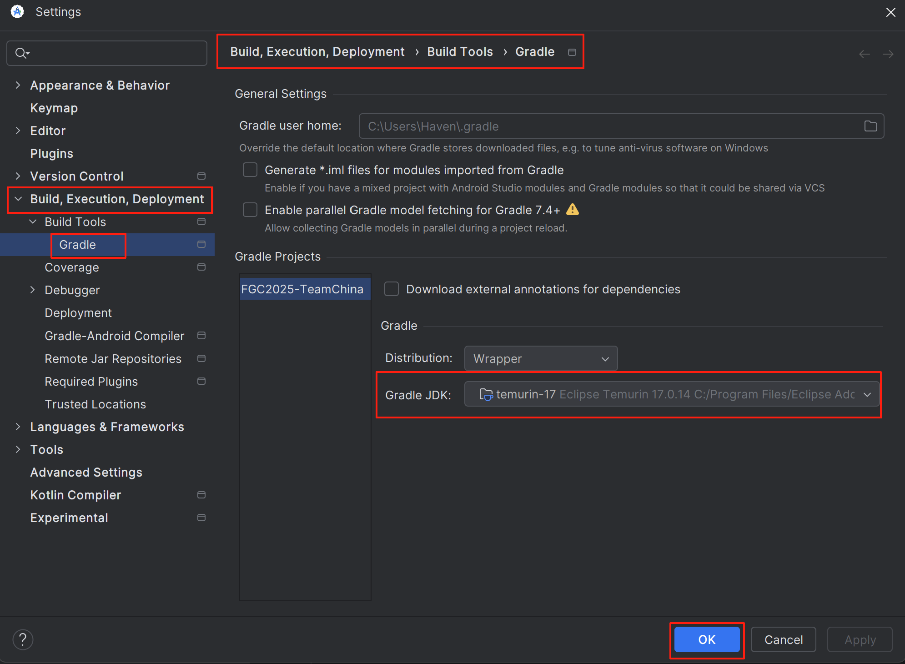

# FGC Team China Codes
This repository is used for FIRST Global Challenge 2025.

Our hardware components are instantiated in the subsystems, and commands contain the actions we need to use during the whole match.

1. What **IDE** are you using?

   We use [Android Studio](https://ftc-docs.firstinspires.org/en/latest/programming_resources/android_studio_java/Android-Studio-Tutorial.html) and Java to code our robots. And you need to connect your device with Control Hub to upload your codes.

2. What **third-party libraries** are you using?

   In this project, we utilized
   
   + [FTCLib](https://docs.ftclib.org/ftclib), which users can use their FRC-like interfaces.
   + [FTC Dashboard](https://acmerobotics.github.io/ftc-dashboard/), which users can easily output desired values and change the related parameters while debugging their codes or hardwares.

3. What development environment versions are you using? 

   We use Java 17 and Gradle 7.4.2 for this project. 

   If you need to change your JDK version, you can download Java 17 from [Oracle Java Downloads](https://www.oracle.com/java/technologies/downloads/) and configure it in Android Studio via:

    File → Settings → Build, Execution, Deployment → Build Tools → Gradle → select Java 17 as the Gradle JDK.

   This modification will only apply to this project and will not affect the JDK version settings of your other projects.